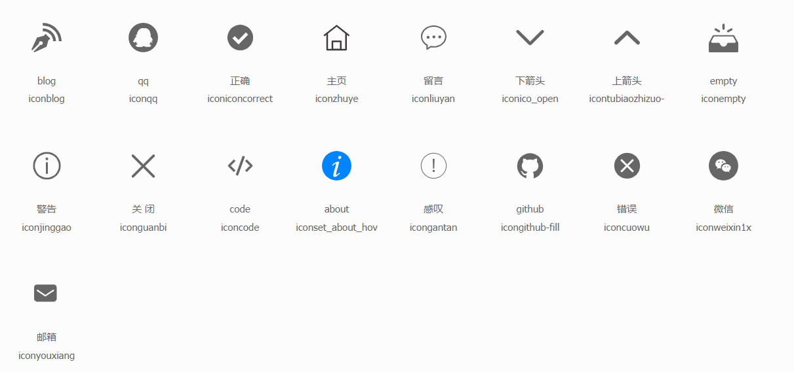

[toc]

# Avatar

## 属性
| 属性名  | 含义  | 类型 | 必填  |   默认值|
|------|-----|---------|----------|------|
|url   | 头像的路径 |  String |  是 | 无  |
|size   | 头像的尺寸 | Number  | 否  | 150 |

# Icon

图标组件
## 属性
| 属性名  | 含义  | 类型 | 必填  |   默认值|
|------|-----|---------|----------|------|
|type  | 图片类型 |  String |  是 | 无 |

有效的图标类型

# Pager

## 属性

| 属性名  | 含义  | 类型 | 必填  |   默认值|
|------|-----|---------|----------|------|
|current  | 当前页码 |  Number |  否 | 1  |
|total  | 总页数 |  Number |  否 | 0  |
|limit  | 页码量 |  Number |  否 | 10  |
|visibleNumber  | 可见页码数 |  Number |  否 | 10  |
## 事件

| 事件名  | 含义  | 事件参数 | 参数类型  |
|------|-----|---------|----------|
|pageChange  | 页码变化 |  新的页码 |  Number |

